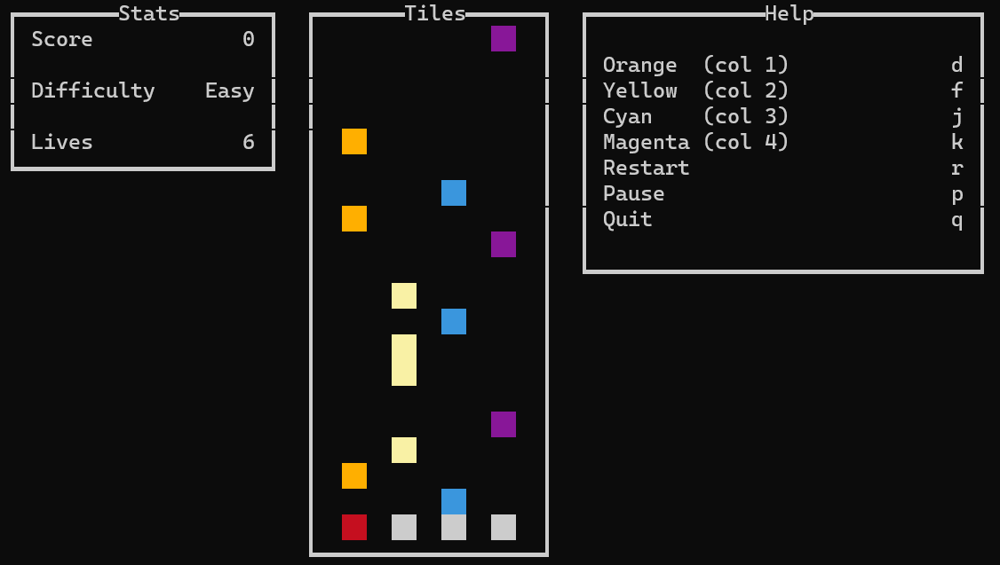

# TILES - CSE 230 Final Project

### Overview

The goal of CSE230's Final Project is to create a Haskell line application from scratch using the brick library. Our proposed application is a simple tapping game mainly inspired by classic games like: Piano Tiles and Tap Tap Revenge.

## Game Description

The game begins by asking the player what difficulty they want to play at: 'Easy', 'Medium', and 'Hard'. Each difficulty is associated with a specific speed that respectively gets faster. There is a main grid with four columns of 'tiles' that will run down the terminal. Starting from the left, the tiles will be colored: red, yellow, cyan, and magenta. As they reach the bottom of the grid, the player must press a specific key associated to the column. The guide on which key to press can be found when you run the game. The player has 3 lives, and if they fail to time a tile correctly, they will lose a life. The score is simply a tally of how many tiles the player times correctly before the player runs out of lives.

## How to play

### Set up to use Euterpea

To use Euterpea, you must have a MIDI software synthesizer on your machine. Windows typically has one already, but for Mac/Linux users, they can install [SimpleSynth](https://github.com/notahat/simplesynth) (Mac) or [FluidSynth](https://www.fluidsynth.org/) (Mac/Linux). After installing the synthesizer, you must have it open in the background before starting the game. Otherwise, Euterpea will not be able to function without detecting any sound devices. More details can be found on Euterpea's [website](https://www.euterpea.com/).

We used FluidSynth for the synthesizer and downloaded it following this [site](https://github.com/FluidSynth/fluidsynth/wiki/Download). In order to run the program, in the command line, type the command <code>fluidsynth SoundFont.sf2</code> where SoundFont.sf2 is a SoundFont file. You may download one from the internet to test. [Here](https://sites.google.com/view/hed-sounds/salamander-c5-light?pli=1) is a link to download the SoundFont file we used to test. Once you have it running, open another terminal to play the game.

### If you cannot compile Euterpea

If Euterpea is unable to compile, you can:
1. Comment out the 'extra-dependencies in stack.yaml (lines 5-10).
2. In tiles.cabal, comment out Euterpea dependency (lines 23 and 35).
3. In Game.hs, comment out lines 24, 27-47, 90, and 105-108.

### Commands To Run

1. Install stack
2. Clone repo
3. Go to root directory of project
4. Run <code>stack build</code>
5. Run <code>stack exec tiles</code>

## Project Goals

### Basic

1. The game has randomized tiles fall down the screen
2. The player can press a key at the right time when the tile hits the bottom
3. The game keeps track of correct timing and adds a point to the total score

### Enhanced Game Elements

1. Difficulty levels (easy, med, hard) to add variety to the experience
2. Player lives to add a 'lose' condition to the experience
3. Background music to make the game more enjoyable

### Additional Features to Implement

1. Variation of tiles (extended tiles or multiple tiles)
2. Local 2-player competitive mode
3. Different modes of the game (endless tile mode - no lives)
4. Score multiplier
5. Users can import own music

## Testing

We created Unit Tests using the Tasty, inspired by the HUnit package. Board.hs, Logic.hs, and Graphic.hs contain unit tests categorized by what they're mainly dealing with. All of these tests are aggregated and run in Test.hs

Run <code>stack test</code> to run the Test Suite.

## YouTube Video

https://www.youtube.com/watch?v=NGTNY2NXSnY&ab_channel=BrianNguyen

## Contributions

Justin:
Core functionality such as: tiles falling down and the graphics of the tiles. Optimized the smoothness of the game by debugging unnecessary features.

Brian:
Helped in creating graphics for the keys (which are used to dilineate where the tiles stop). Created the test suite frame work and test cases. Set up presentation slides and materials.

Brittany:
Helped in creating the test suite, graphics, and tried to get background music working. Ran the demo of the game for presentation.

Victor:
Enhanced game elements such as: a working score system, difficulty settings, a nice UI for stats and legend. Worked on the user feedback on key presses.
